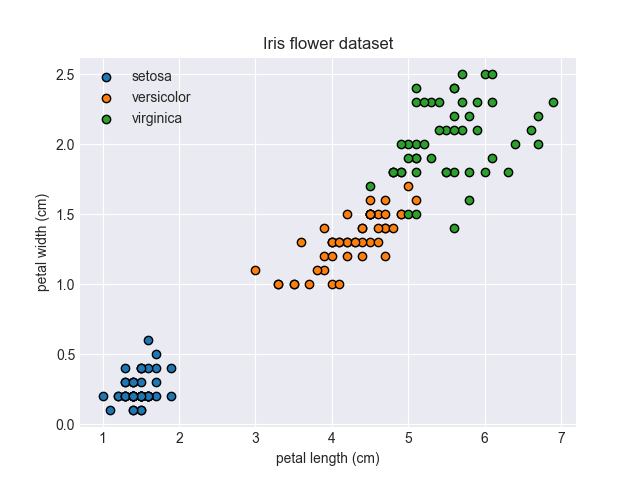
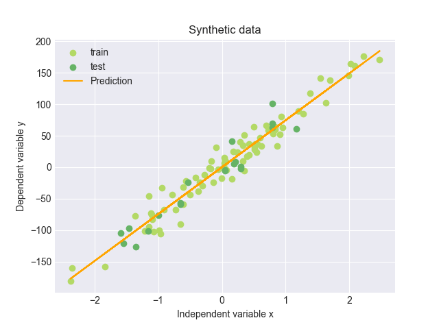

# ML-Basics
### Python implementation of basic ML algorithms from scratch using numpy and pandas

## 1. K Nearest Neighbors (KNN)
- KNN is a simple algorithm that stores all available cases and classifies new cases based on a similarity measure (e.g., distance functions).
- Iris Dataset
  - 

## 2. Linear Regression
- Linear regression is a linear approach to modeling the relationship between a scalar response (or dependent variable) and one or more explanatory variables (or independent variables).
- 
