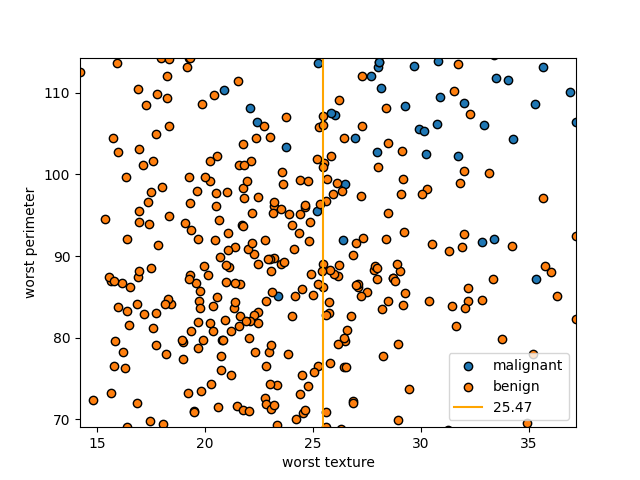

# ML-Basics
### Python implementation of basic ML algorithms from scratch using numpy and pandas

## 1. K Nearest Neighbors (KNN)
- KNN is a simple algorithm that stores all available cases and classifies new cases based on a similarity measure (e.g., distance functions).
- Iris Dataset: 

## 2. Linear Regression
- Linear regression is a linear approach to modeling the relationship between a scalar response (or dependent variable) and one or more explanatory variables (or independent variables).
- Model: 
- Equations: 

## 3. Logistic Regression
- Logistic regression is a statistical model that in its basic form uses a logistic function to model a binary dependent variable.
- Model: 
- Equations: 
- Equations: 
$$
Considering binary classification, we can model the output as $-wx+b$ and then squeeze the value between 0 and 1 as a probability. We can use sigmoid to scale the value for binary classification and softmax for n-ary classification. \newline
\[ \hat{y} = h_{\theta}(x) = \frac{1}{e^{-wx+b}} \]
Using cross entropy as \newline
\[CE_{loss} = \sum_{i=1}^{n} P^{*}(x_{i}*logP(x_{i}))\]
where $P^{*}(x_{i})$ = true probability \newline
and $P(x_{i})$ = predicted probability \newline
when y == 1, $CE_{loss} = \sum_{i=1}^{n}y_{i} * log h_{\theta}(x_{i})$ \newline
else 0 when y == 0 \newline
                           OR \newline
when y == 0 $CE_{loss} = \sum_{i=1}^{n}(1-y_{i})*log (1 - h_{\theta}(x_{i}))$ \newline
else 0 when y == 1 \newline
Combining both the losses \newline
\[J_{w,b} = \sum_{i=1}^{n} y_{i} * log h_{\theta}(x_{i}) + (1-y_{i})*log (1 - h_{\theta}(x_{i}))\]
\[\frac{dJ}{dw} = \sum_{i=1}^{n} \frac{y_{i}}{h_{\theta}(x_{i})} * \frac{dh_{\theta}(x_{i})}{dw} - \frac{1-y_{i}}{1-h_{\theta(x_{i})}} * \frac{dh_{\theta}(x_{i})}{dw} ==> eq. (I)\]  
Similarly, \newline
\[\frac{dJ}{db} = \sum_{i=1}^{n} \frac{y_{i}}{h_{\theta}(x_{i})} * \frac{dh_{\theta}(x_{i})}{db} -  \frac{1-y_{i}}{1-h_{\theta}(x_i)} * \frac{dh_{\theta}(x_{i})}{db}  ==> eq (II)\]
\newline All we need is to find $\frac{dh_{\theta}(x_{i})}{dw}$ and $\frac{dh_{\theta}(x_{i})}{db}$ and substitute the values in eq I and eq. II respectively \newline
Let's start with $\frac{dh_{\theta}(x_{i})}{dw}$ \newline
\[h_{\theta}(x_{i}) = \frac{1}{1+e^{-wx+b}}\]
$= \frac{1}{1+e^{z}}$ when $z = -wx+b$ \newline
\[ \frac{h_{\theta}(x_{i})}{dz} = \frac{d}{dz}[\frac{1}{1 + e^{z}}]\]
Using $\frac{d}{dx}[\frac{f(x)}{g(x)}] = \frac{f^{'}(x)g(x) - g^{'}(x)f(x)}{|g(x)|^2}$ \newline
\[= \frac{0*(1+e^{z}) - 1*(e^{z})}{(1+e^{z})^2}\]
\[= \frac{-e^{z}}{(1+e^{z})^2}\]
\[= \frac{-e^{z}}{1+e^{z}} * \frac{1}{1+e^{z}}\]
\[= -h_{\theta}(x_{i})(1 - h_{\theta}(x_{i})) ==> eq(III)\]
\newline using z = -wx+b \newline
\[\frac{dz}{dw} = -x ==>eq(IV)\]
\[\frac{dz}{db} = 1 ==>eq(V)\]
\[\frac{dh_{\theta}(x_{i})}{dw} = \frac{dh_{\theta}(x_{i})}{dz} * \frac{dz}{dw}\]
\newline Applying eq IV and III above \newline
\[= x*h_{\theta}(x_{i})(1 - h_{\theta}(x_{i})) ==> eq(IV)\]
Similarly, using eq. III and eq. V \newline
\[\frac{dh_{\theta}(x_{i})}{db} = -h_{\theta}(x_{i}) (1 - h_{\theta}(x_{i})) ==> eq(VII)\]
\newline Applying eq. VI in eq. I\newline
\[\frac{dJ}{dw} = \sum_{i=1}^{n} y_{i} * x_{i} * (1-h_{\theta}(x_{i})) - (1-y_{i})*x_{i}*h_{\theta}(x_{i})\]
\[= \sum_{i=1}{n} x_{i}*y_{i} - x*h_{\theta}(x_{i})\]
\[= \sum_{i=1}^{n} x_{i}(y_{i} - h_{\theta}(x_{i}))\]
\newline Since $h_{\theta}(x_{i})$ is predicted value $\hat{y}$ \newline
\[\sum_{i=1}^{n} x_{i}(y_{i} - \hat{y})\]
in closed form \newline
\[\frac{dJ}{dw} = X^{T}*(y - \hat{y})\]
\newline Similarly \newline
\[\frac{dJ}{db} = \sum_{i=1}^{n}(y - \hat{y})\]
$$

## 4. Decision Trees
- Decision tree learning is a method commonly used in data mining. The goal is to create a model that predicts the value of a target variable based on several input variables.
- Model: , , 

## 5. Random Forest
- TBD
- Model: 

## 6. Naive Bayes
- Naive Bayes classifiers are a family of simple "probabilistic classifiers" based on applying Bayes' theorem with strong (naive) independence assumptions between the features.
- Posterior Probability Equation: 
