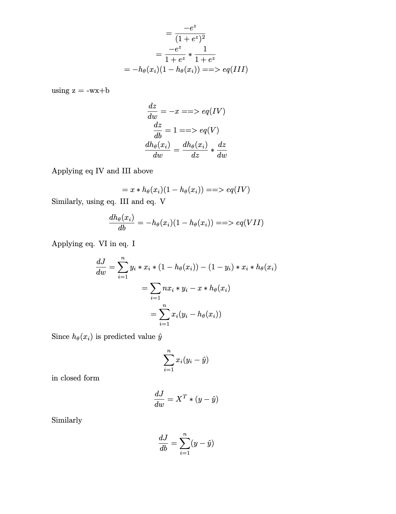

# ML-Basics
### Python implementation of basic ML algorithms from scratch using numpy and pandas

## 1. K Nearest Neighbors (KNN)
- KNN is a simple algorithm that stores all available cases and classifies new cases based on a similarity measure (e.g., distance functions).
- Iris Dataset: 

## 2. Linear Regression
- Linear regression is a linear approach to modeling the relationship between a scalar response (or dependent variable) and one or more explanatory variables (or independent variables).
- Model: 

- Equations: 

## 3. Logistic Regression
- Logistic regression is a statistical model that in its basic form uses a logistic function to model a binary dependent variable.
- Model: 

- Equations: 
 
## 4. Decision Trees
- Implementation is done to create a binary for a specific value among all continuous feature value
- Most optimal feature, split pair is found where entropy is minimum 
- Entropy H(p) = -plog(p) -(1-p)log(p)
- when best feature, split pair is found, tree node with subset of X, subset of y, and feature index is created
- above process is repeated unless entropy is 0 or max depth is reached
- label from leaf node is used as prediction. If leaf node is pure, single label is returned, else most common label is predicted
- Model: , , 

## 5. Random Forest
- Same as Decision Tree but multiple decision trees are created using random subset of features
- prediction is made by majority voting for classification or mean for regression
- since subset of features are used, correlation is reduced among features. Also variance is reduced. hence less overfitting 
- Model: 

## 6. Naive Bayes
- Naive Bayes classifiers are a family of simple "probabilistic classifiers" based on applying Bayes' theorem with strong (naive) independence assumptions between the features.
- Posterior Probability Equation: 
